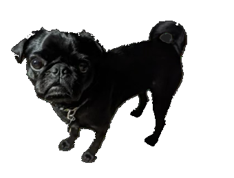

# 🐶 Pug Sanctuary.exe (Y2K Virtual Pet Game)



**Pug Sanctuary.exe** is a retro Y2K desktop-inspired virtual pet game built with HTML5, CSS3, JavaScript, and Firebase. Inspired by nostalgic classics like *Nintendogs*, *Tamagotchi*, and *Old Dog Haven*, players can adopt senior/rescue pugs, feed them, give them baths, dress them up, play interactive mini-games, and build their ultimate sanctuary!

---

## 🌟 Key Features

- 🖥️ **Y2K Windows Desktop Aesthetic**: Nostalgic 90s/2000s desktop window UI complete with title bars, retro sound effects, tab switches, and pixel fonts.
- 🐾 **Adopt & Care for Pugs**: Name your pugs, track their hunger, hygiene, happiness, and energy levels in real-time.
- 🦴 **Continuous Platformer Walking Mini-Game**: Take your pug on a walk in the park! Use arrow keys to jump and navigate past obstacles to collect bones and earn **PugBucks ($P)**.
- 🛁 **Interactive Soap & Rinse Bath Mini-Game**: Lather your pug with shampoo bubbles using the soap tool, then rinse them clean with the interactive shower nozzle.
- 🛍️ **PugMart Shop & Decorations**: Earn PugBucks and EXP to level up your sanctuary and unlock new toys, treats, beds, flower boxes, and dog houses.
- 💾 **User Accounts & Progress Persistence**: Log in with your username to automatically save and sync your sanctuary progress across devices.

---

## 🎮 How to Play

1. **Adopt a Pug**: Pick a starting pug pose and give your pug a custom name.
2. **Care for Your Pugs**:
   - Click **Place Food Bowl** or **Place Toy** on the grass field to feed and entertain your pugs.
   - Use the **Poop Scoop** tool to keep the sanctuary clean!
3. **Mini-Games**:
   - **Walk Mode**: Use `Arrow Up` / `Space` to jump over obstacles and collect bone gifts.
   - **Bath Mode**: Click the shampoo tool to suds up your pug, then switch to the shower nozzle to rinse them sparkling clean.
4. **PugMart**: Visit the shop tab to buy kibble, treats, heart rugs, solar fountains, and orthopedic beds as you level up.

---

## 🛠️ Built With

- **HTML5 & CSS3**: Custom Y2K window styling, responsive flexbox layout, and CSS animations.
- **JavaScript (ES6+)**: Custom Canvas 2D engine for physics, minigame collision detection, particle systems, and audio management.
- **Firebase Auth & Firestore**: Save state persistence and user authentication.
- **Web Audio API**: Retro sound effects (squeaks, barks, coins, level-ups).

---

## 🚀 Local Development Setup

To run Pug Sanctuary locally on your machine:

1. **Clone the Repository**:
   ```bash
   git clone https://github.com/mharrell1/Pug-Sanctuary.git
   cd Pug-Sanctuary
   ```

2. **Serve the Files**:
   Using Python's built-in HTTP server:
   ```bash
   python3 -m http.server 8080
   ```

3. **Open in Browser**:
   Navigate to `http://localhost:8080` in your web browser.

---

## 📄 License

Distributed under the MIT License. See `LICENSE` for more information.
